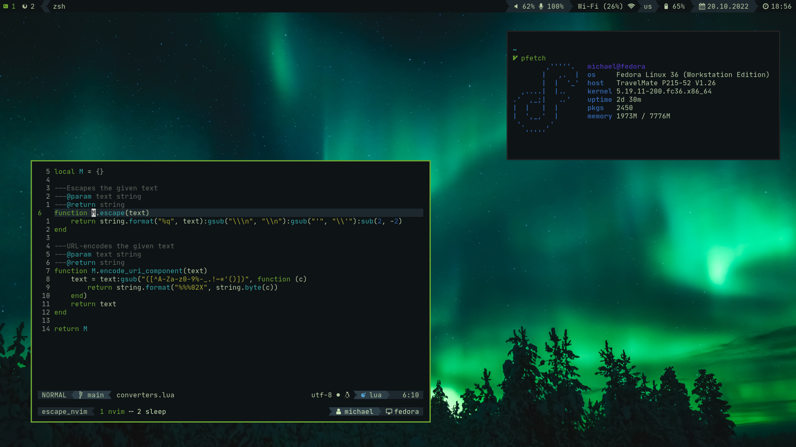

# Preview

## bspwm

[Wallpaper](https://www.pexels.com/photo/purple-rose-on-wooden-surface-971360/)
[Rofi Background](https://www.pexels.com/photo/close-up-photo-of-purple-lilac-flowers-1381679/)

## sway

[Wallpaper](https://www.pexels.com/photo/beautiful-aurora-borealis-in-the-sky-11042734/)

# Software I use

* Editor: neovim
* Window Manager: sway/awesome
* Shell: zsh
* Terminal multiplexer: tmux
* Launcher: rofi/wofi
* Terminal: kitty
* Notifications: dunst
* Setup: [ansible](https://github.com/m-gail/ansible), stow
