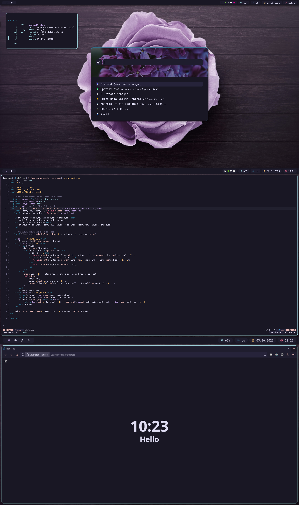

# Preview

## awesome

[Wallpaper](https://www.pexels.com/photo/purple-rose-on-wooden-surface-971360/)

[Theme](https://github.com/rose-pine)

## bspwm

[Wallpaper](https://www.pexels.com/photo/purple-rose-on-wooden-surface-971360/)

[Rofi Background](https://www.pexels.com/photo/close-up-photo-of-purple-lilac-flowers-1381679/)

[Theme](https://github.com/rose-pine)

## sway

[Wallpaper](https://www.pexels.com/photo/beautiful-aurora-borealis-in-the-sky-11042734/)

# Software I use

- Editors:
  - neovim
  - doom emacs (for notes)
  - IntelliJ (for Java)
- Terminal multiplexer: tmux
- Window Manager: awesome
- Shell: zsh
- Launcher: rofi
- Terminal: kitty
- Notifications: dunst
- Widgets: eww
- Setup: [ansible](https://github.com/m-gail/ansible), stow
